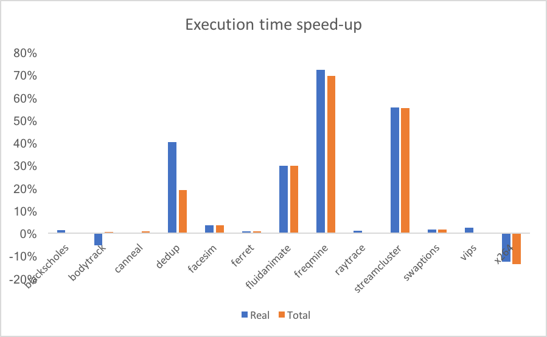

## Next steps
There are four "holes" that I feel must be filled to make the simple case and wanted to get your input before fleshing them out with possible experiments / analyses:

1. What is really going on with the applications under contention? What classes of applications (or stages of applications) are there and how do they interact?

2. Why do existing approaches not resolve these issues? This should be much more exhaustive. There are several straw man solutions we proposed but did not test. We should also be extremely clear about what existing parallel programming libraries are doing.

3. How and why does our simple solution work? Thread contention is one case, but we want to get a more nuanced picture of different resources.

4. Are PARSEC and our simulated workloads really representative of real-world scenarios?

We discuss all four in the paper, but at a high-level and without experimental results. For me, this is why the paper is unsatisfying.

Once we fill the holes, we can discuss how to develop a more sophisticated solution.

- cost context switching
- hyperthreading / NUMA
- \# of applications changes
- better scheduler

## TODO
- What if each application looked into stuff on its own and made decisions independently?
- Argue for why 256 overprovision is good (speed up curves)
- 256 threads in experiments (over-provisioned)
- Why does contention happen?
- Scheduling algorithm details
- Other scheduling algorithms
- Expand related work
- Fix references
- How to modify parallelism in applications?
- Open source? How would we make this usable?
- Back-off punishment (i.e., delta between where you are and new rec -> amount of time to change)
- Compare with cooperative scheduling (i.e., yields)
- Expand beyond just CPU-intensive?
- Isolation vs virtualization
  - OS can still take over
  - Applications are responsible for changing behavior
  - Other applications are not hurt if you don't change behavior (punishment)
- Store raw data in repo
- Generate figures from data during compile
- Measure overhead of converting to work queue. What if we changed parallelism at different stage?
- What if we changed grain size dynamically?
- Not just cloud providers, but cloud service providers (e.g., db as a service)
- Other applications (e.g., dbs)
- Multi-tenancy vs cloud
